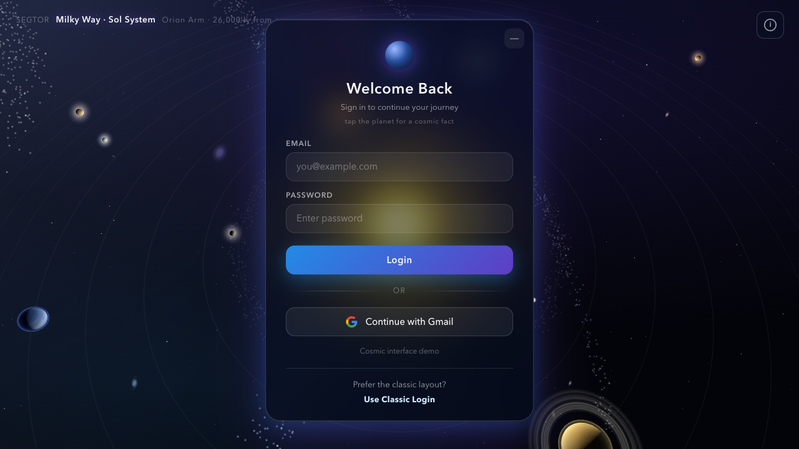
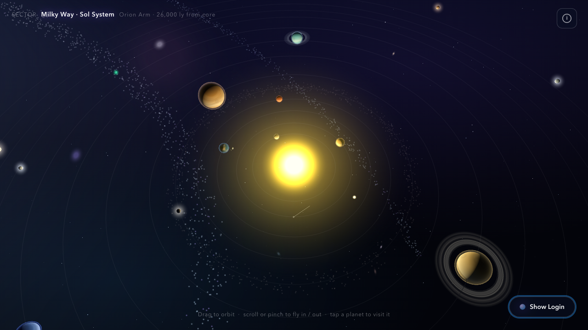
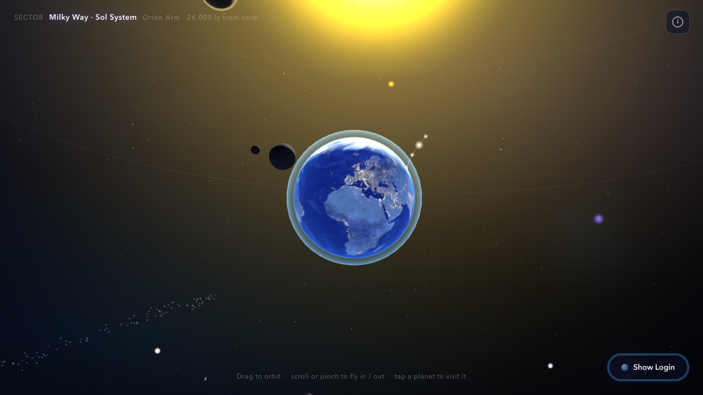
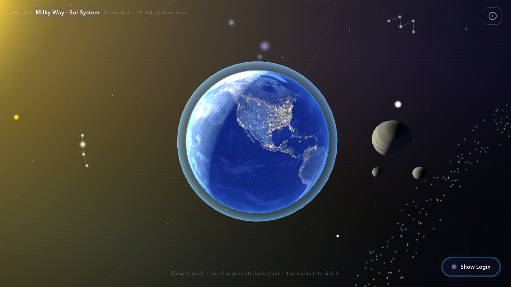
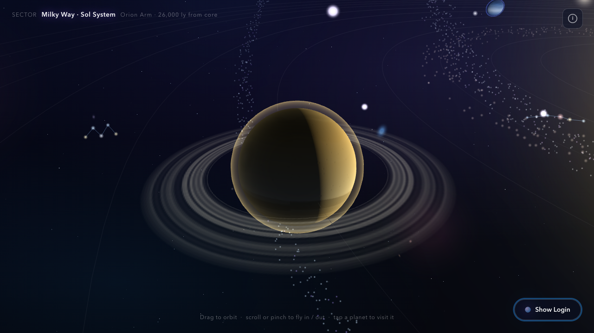
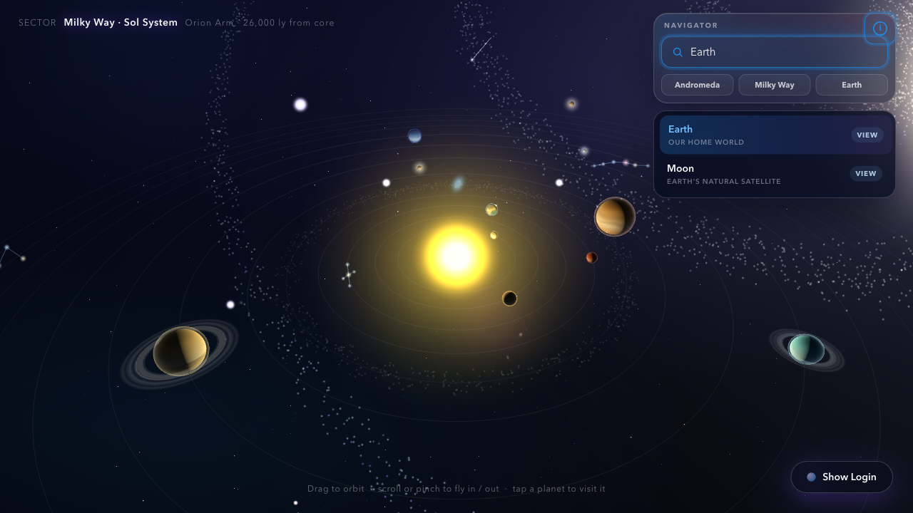

# 🪐 Cosmic Login

**A login screen that's also a fully explorable 3D universe.**

Sign in while drifting through the Milky Way — orbit the Sun, fly out to
Andromeda, tap a planet to learn about it, and pull live fun facts straight
from Wikipedia. Built with [Three.js](https://threejs.org/) and a tiny Flask
backend, it works with a mouse, a trackpad, or your fingers on a touch screen.

> The login form itself is a UI demo — authentication routes are stubbed and
> show *"Under development"*. The cosmos is the real, fully interactive part.

---

## 🎬 Demo

A tour of the solar system — orbit, tilt, zoom, fly to Earth and Saturn, and the
celestial search navigator:


> 🎥 Full-quality video (1280×720, ~28s): [`media/cosmic-login-tour.mp4`](media/cosmic-login-tour.mp4)
> &nbsp; · &nbsp; 🖼️ Lightweight preview above: [`media/cosmic-login-tour.gif`](media/cosmic-login-tour.gif)

| | | |
| :---: | :---: | :---: |
|  |  |  |
| **Login over the universe** | **The full Sol system** | **Detailed, textured Earth** |
|  |  |  |
| **Clouds & city lights** | **Saturn's rings** | **Celestial navigator** |

---

## ✨ Features

### 🌌 A real 3D cosmic explorer
- A procedurally rendered **Milky Way** with the full **Sol system** — the Sun,
  all eight planets, the Moon, an asteroid belt, and the five dwarf planets
  (Ceres, Pluto, Haumea, Makemake, Eris).
- A detailed, textured **Earth** with day map, city lights, and drifting clouds.
- Ringed gas giants, glowing atmospheres, comets, and a deep field of distant
  galaxies stretching to the horizon.
- A second great spiral — the **Andromeda Galaxy** — waiting far across space.
- Famous deep-sky landmarks: the **Orion Nebula**, **Pleiades**, **Crab Nebula**,
  **Whirlpool**, **Sombrero** and **Pinwheel** galaxies, and more.

### 👆 Touch, mouse & trackpad controls
- **Drag to orbit** the camera around whatever you're looking at.
- **Scroll or pinch** to fly in and out — from a planet's surface to far beyond
  the galaxy.
- **Tap or click any object** to fly to it and open its info card.
- Designed mobile-first: generous touch targets and multi-touch pinch-to-zoom.

### 🔭 Celestial navigator (search)
- Open the navigator and **type a destination** — "Andromeda", "Earth",
  "Sirius" — to instantly fly there.
- Quick-jump buttons for featured destinations.

### 📖 Live Wikipedia fun facts
- Tap the **planet orb** by the login panel for a random cosmic fun fact, pulled
  live from Wikipedia (with images), and a graceful built-in fallback offline.
- Every clickable object opens a card with a real Wikipedia summary and a
  "Read more" link.

### 🛰️ Thoughtful interface
- A **Sector HUD** names the region of space you're exploring.
- **Minimize the login panel** to take in the full view, then restore it.
- Honors **`prefers-reduced-motion`** — animations calm down for users who ask.
- Accessible markup: ARIA roles, labels, and keyboard-reachable controls.

---

## 🚀 Quick start

```bash
pip install -r requirements.txt
python app.py
```

Then open **<http://127.0.0.1:5000/>** (it redirects to `/login/cosmic`).

> The fun-fact APIs call `en.wikipedia.org`. Without an internet connection the
> page still runs and falls back to a built-in set of facts.

---

## 🗺️ Routes

| Route                      | Purpose                                      |
| -------------------------- | -------------------------------------------- |
| `/` → `/login/cosmic`      | The interactive cosmic login screen          |
| `/login` (GET/POST)        | Stub — returns *"Under development"*          |
| `/login/google`            | Stub — returns *"Under development"*          |
| `/login/pexel`             | Stub — returns *"Under development"*          |
| `/api/cosmic-fact`         | Random Wikipedia cosmic fun fact             |
| `/api/cosmic-object-fact`  | Fun fact for a clicked celestial object      |
| `/api/cosmic-fact-image`   | Proxies Wikimedia images for the fact cards  |

---

## 📁 Project layout

```
app.py                              # Flask app + cosmic-fact APIs
requirements.txt                    # Flask, Jinja2, Werkzeug
templates/login_cosmic.html         # the page
static/css/cosmic-login.css         # styling
static/js/cosmic-login.js           # the Three.js universe
static/assets/icons/gmail.svg
static/assets/earth/*.{jpg,png}     # Earth textures
```

> The Flask static endpoint is mounted at `/oneos/static` to match the asset
> paths baked into `cosmic-login.js`, keeping the JS/CSS/template identical to
> the original app.

---

## 🛠️ Built with

- **[Three.js](https://threejs.org/)** (loaded via CDN import map) for the WebGL universe
- **[Flask](https://flask.palletsprojects.com/)** for the lightweight backend and fun-fact APIs
- **[Wikipedia REST API](https://en.wikipedia.org/api/rest_v1/)** for live celestial facts and imagery

## 📄 License

Add your preferred license here before publishing.
